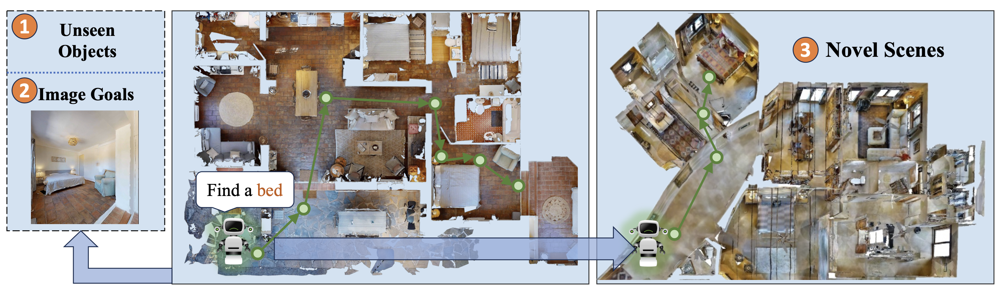
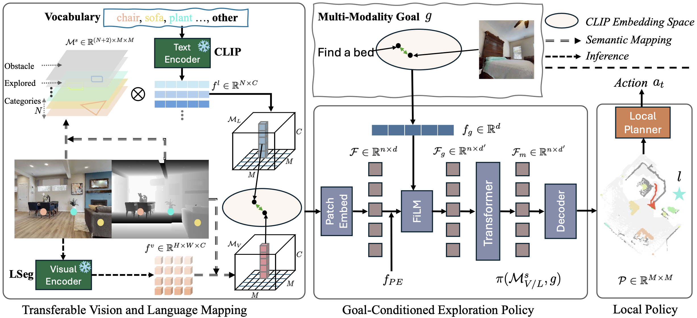

 

<h1 align="center"><strong>OVExp: Open Vocabulary Exploration for Object-Oriented Navigation</strong></h1>
  

  	<!-- <strong>/strong> -->
	 
    <a href='https://github.com/kellyiss' target='_blank'>Meng Wei</a>&emsp;
	<a href='https://tai-wang.github.io/' target='_blank'>Tai Wang</a>&emsp;
    <a href='https://yilunchen.com/about/' target='_blank'>Yilun Chen</a>&emsp;
    <a href='https://hanqingwangai.github.io/' target='_blank'>Hanqing Wang</a>&emsp;
    <a href='https://oceanpang.github.io/' target='_blank'>Jiangmiao Pang*</a>&emsp;
	<a href='https://xh-liu.github.io//' target='_blank'>Xihui Liu*</a>&emsp;
     
    The University of Hong Kong&emsp;Shanghai AI Laboratory
     
  

## 🏠 About
<!--  -->

    

Object-oriented embodied navigation aims to locate specific objects, defined by
category or depicted in images. Existing methods often struggle to generalize to
open vocabulary goals without extensive training data. We introduce OVExp, a
learning-based framework that integrates VLMs for Open-Vocabulary Exploration.
The simple but effective design of OVExp significantly reduces computational costs
and demonstrates strong generalization abilities to various navigation settings.
Experiments on established benchmarks show OVExp outperforms previous zero-
shot methods, can generalize to diverse scenes, and handle different goal modalities 

## 📦 Method Overview

  

The proposed OVExp framework mainly consists of three modules: (1) The
Transferable Vision and Language Mapping module for constructing a visual/language memory
map to comprehend the scene holistically. (2) The Goal-Conditioned Exploration Policy module for
learning scene priors from the map representations and predicting the long-term goal location with a
goal-conditioned exploration network. (3) The Local Policy module for analytical planning which
determines the next waypoint towards the predicted long-term goal.

## 📝 TODO List

- \[ \] Release Semantic Map Dataset and Code for Training the Goal-Conditioned Exploration Policy .
- \[ \] Release Inference Code for Object-Goal Navigation on HM3D and MP3D.
- \[ \] Release Inference Code for InstanceImage-Goal Navigation on HM3D.

## 📄 License

 
This work is under the <a rel="license" href="http://creativecommons.org/licenses/by-nc-sa/4.0/">Creative Commons Attribution-NonCommercial-ShareAlike 4.0 International License</a>.

## 👏 Acknowledgements

This repository benefits significantly from the contributions and resources of [home-robot](https://github.com/facebookresearch/home-robot), [PEANUT](https://github.com/ajzhai/PEANUT), [PONI](https://github.com/srama2512/PONI). 